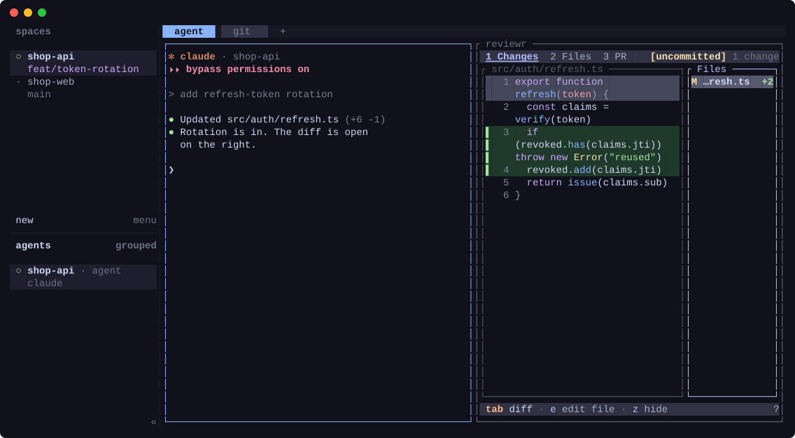

# herdr-respawn

[English](README.md) | 한국어



[Herdr](https://herdr.dev) 서버를 재시작하거나 머신을 재부팅해도 하던 작업을 그대로 이어가게 해 주는 플러그인이에요.

Herdr는 워크스페이스, 탭, 페인, cwd를 스스로 복원하고, 지원하는 에이전트도 다시 열어 줘요. 다만 에이전트는 처음 실행할 때 준 인자 없이 열리고, 그 밖의 페인은 모두 빈 셸로 돌아와요. respawn은 서버가 다시 뜨자마자, 키 입력 없이 그 페인들에서 돌던 것을 되살려요.

- 띄워 두었던 **TUI**: lazygit, vim, htop, yazi 등 [허용 목록](#허용-목록)에 있는 명령
- 에이전트 옆에 띄운 [reviewr](https://github.com/persiyanov/herdr-reviewr) diff 같은 **플러그인 페인**
- **Claude Code의 agent view** (`claude agents`)
- 설정 한 줄을 추가하면 **실행 인자를 유지한 에이전트**: `claude --dangerously-skip-permissions`로 연 세션이 권한 우회 상태 그대로 돌아와요([자세히](#에이전트-실행-인자-유지))

앞의 세 가지는 설정할 게 없어요. 설치하면 바로 저장을 시작해요.

## 설치

```sh
herdr plugin install devicki/herdr-respawn --ref v0.7.2
```

`--ref`는 설치할 릴리스를 고정해요. 빼면 `main` 브랜치의 최신 코드가 설치돼요. 릴리스 목록은 [tags](https://github.com/devicki/herdr-respawn/tags)에서 볼 수 있어요.

Herdr 서버를 쓰는 계정마다 설치하세요. 서버마다, 그리고 네임드 세션마다 스냅샷을 따로 저장해요. 첫 복원은 플러그인이 한 번 저장한 뒤의 다음 재시작 때 일어나요. 저장은 페인 포커스를 옮기는 순간 바로 돼요.

**호환성**: Linux와 macOS에서 동작해요. `bash`(macOS 기본인 3.2로 충분해요)와 `jq` 1.6 이상(macOS는 `brew install jq`)이 필요해요. Windows는 지원하지 않으니 WSL에서 Herdr를 실행하세요.

## 동작 방식

- **저장**: `pane.focused`, `tab.focused`, `workspace.focused`, `pane.closed`, `pane.agent_status_changed` 이벤트가 발생할 때마다 각 페인의 포그라운드 명령(argv)과 cwd를 확인해요. 허용 목록에 있는 명령이면 플러그인 상태 폴더에 저장해요. 에이전트는 세션 id와 함께([자세히](#에이전트-실행-인자-유지)), 플러그인 페인은 어떤 플러그인인지로([자세히](#플러그인-페인)) 저장해요. 바로 저장하고 싶으면 `respawn: save now` 액션을 실행하세요.
- **복원**: Herdr가 세션 복원을 마치면 시작 훅이 실행돼요. 저장해 둔 명령을 `herdr pane run`으로 원래 페인에 다시 입력하고, 뒤에 있는 탭이나 워크스페이스의 페인도 포함돼요. 단, 그 페인이 빈 셸 프롬프트로 돌아왔을 때만(앞에서 대화형 셸 하나만 돌고 있을 때만) 입력해요. 아직 시작 중인 셸(rc 파일, fish 설정, 프롬프트 도구 실행 중)은 최대 15초까지 기다려 줘요. 그 뒤에도 스크립트, `sh -c` 작업, 라이브 핸드오프처럼 뭔가 실행 중인 페인은 건드리지 않아요.
  - 명령 앞에 공백을 붙여 셸 히스토리에 남지 않게 해요(fish는 기본으로, bash는 `HISTCONTROL=ignorespace`/`ignoreboth`, zsh는 `setopt HIST_IGNORE_SPACE`일 때).
  - 페인의 셸이 저장된 폴더에 있지 않으면 `cd <폴더> &&`를 앞에 붙여요. 그 폴더가 없어졌다면 명령은 실행되지 않아요.
  - 재부팅 후 사라진 절대 경로의 프로그램(임시 폴더나 `/nix/store` 아래 경로 포함)은 프로그램 이름으로 바꿔서, 셸의 `PATH`에서 찾게 해요.
- **시스템 종료**: 컴퓨터가 꺼지는 도중에도 연결이 남아 있는 클라이언트(예: 노트북의 SSH 연결)가 Herdr를 다시 켤 수 있어요. 그 서버는 곧 모든 페인이 강제로 꺼지는 걸 보게 되고, 이를 "페인을 닫았다"로 저장해 워크스페이스를 지워 버려요. respawn 저장도 꺼지는 페인을 기록하게 돼요. 그래서 systemd 환경에서는 logind가 종료를 알리는 순간부터(Herdr가 저장하는 바로 그 신호로, 실제 종료가 시작되기 최대 30초 전이에요) respawn이 저장하지 않고, 그렇게 켜진 서버는 시작하자마자 멈춰요. 멈출 때 방금 불러온 레이아웃이 그대로 저장되고, 스냅숏은 재부팅 뒤 시작을 기다려요.
- 스냅샷 파일이 깨졌으면 `<파일>.bad`로 옮기고 새로 저장을 시작해요. 삭제된 네임드 세션의 스냅샷은 시작할 때 정리해요.

### 복원 알림

respawn은 `respawn: 4 pane(s) restored`처럼 복원한 개수와 이름을 토스트로 알려 줘요. Herdr의 토스트는 기본으로 꺼져 있고, 서버가 시작될 때 연결된 클라이언트에만 보여요. 알림을 보려면 이렇게 설정하세요.

```toml
[ui.toast]
delivery = "herdr"      # 데스크톱 알림을 원하면 "terminal" 또는 "system"
```

[herdr-pager](https://github.com/devicki/herdr-pager)를 설치해 켜 두면, 연결된 클라이언트가 없어도 폰으로 같은 소식이 가요.

```
🔄 [work] Herdr 재시작 · respawn이 페인 4개 복원
claude x2, lazygit, persiyanov.reviewr
```

알림은 herdr-pager의 설정과 언어(`pager.conf`에 `lang = ko`면 한국어)를 따르고, named session이면 세션 이름도 붙여요. 따로 설정할 건 없고, herdr-pager가 없으면 지금과 똑같이 동작해요.

## 허용 목록

아무 명령이나 다시 실행하면(`git push`, 마이그레이션 등) 위험하기 때문에, 아래 명령만 다시 실행해요.

```
lazygit lazydocker tig gitui vim nvim vi hx micro nano emacs htop btop top yazi ranger lf nnn k9s
```

목록은 `$(herdr plugin config-dir devicki.respawn)/allowlist`(보통 `~/.config/herdr/plugins/config/devicki.respawn/allowlist`)에서 바꿀 수 있어요. 플러그인이 처음 실행될 때 기본 목록과 작성법을 주석으로 적은 파일을 만들어 둬요. 한 줄에 이름 하나씩 쓰면 추가되고, `!이름`으로 쓰면 목록에서 빠져요. 이름은 페인에서 셸이 실행한 명령의 파일 이름과 비교해요. 그 명령이 띄운 하위 프로세스는 보지 않아서, lazygit이 내부적으로 실행하는 `git log`가 lazygit 대신 저장되는 일은 없어요.

```
# 항상 다시 띄우고 싶은 개발 서버
npm
# top은 다시 실행하지 않기
!top
```

## 에이전트 실행 인자 유지

Herdr는 Claude Code, Codex, Devin 같은 에이전트를 스스로 다시 열지만, 항상 `claude --resume <id>`처럼 인자 없이 열어요. 그래서 처음 실행할 때 준 인자가 사라져요. 예를 들어 `claude-yolo` 같은 alias로 `claude --dangerously-skip-permissions`를 실행했던 세션은 다시 열리면 권한 확인을 다시 요청해요. Claude Code가 resume할 때 bypass 모드를 일부러 복원하지 않기 때문이에요.

인자를 유지하려면 `config.toml`에서 Herdr의 에이전트 복원을 끄세요.

```toml
[session]
resume_agents_on_restore = false
```

그러면 respawn이 Herdr가 기록한 세션 id와 아래 실행 인자로 Claude Code, Codex, Devin을 직접 다시 열어요.

| 에이전트 | 다시 여는 명령 | 유지하는 인자 |
| --- | --- | --- |
| Claude Code | `claude <인자> --resume <id>` | `--dangerously-skip-permissions`, `--allow-dangerously-skip-permissions`, `--permission-mode`, `--model` |
| Codex | `codex resume <인자> <id>` | `--dangerously-bypass-approvals-and-sandbox`, `-s`/`--sandbox`, `-a`/`--ask-for-approval`, `-m`/`--model` |
| Devin | `devin <인자> --resume <id>` | `--permission-mode`, `--model` |

그 밖의 인자와 프롬프트는 빼고 열어요. Herdr의 에이전트 복원이 켜져 있으면(기본값) respawn은 에이전트를 건드리지 않아요. 둘이 같은 페인에 동시에 입력하게 되기 때문이에요.

- 복원을 끄면 이 세 가지 외의 에이전트는 빈 셸로 돌아와요. 다른 에이전트도 쓴다면 켜 두세요.
- 에이전트는 Herdr의 기본 복원처럼 0.1초 간격으로 하나씩 켜요. 에이전트는 켤 때마다 런타임과 MCP 서버를 같이 띄우고, Claude Code 세션들은 설정 파일을 함께 쓰기 때문에 한꺼번에 켜면 순간 부하가 커져요. 세션이 많다면 Herdr 설정에서 간격을 늘리세요. respawn도 이 값을 따라요.

  ```toml
  [session]
  startup_per_agent_delay_ms = 1000
  ```

  TUI와 플러그인 페인은 바로 켜요.
- Herdr 0.9.2부터는 에이전트가 실행 옵션을 포함한 "다시 여는 명령"을 Herdr에 직접 알려 줄 수 있어요. 이런 에이전트는 Herdr 복원을 켜 둔 상태로도 실행 옵션이 유지돼서 respawn이 필요 없어요.
- 에이전트가 자기 이름(`claude`, `codex`, `devin`)으로 실행돼야 해요. `npx` 같은 래퍼로 실행한 경우는 인식하지 못해요.
- Claude Code의 agent view(`claude agents`)는 백그라운드 세션을 관리하는 화면이라 다시 열 세션이 없어요. 그래서 실행했던 인자 그대로 다시 실행해요. Herdr의 에이전트 복원이 켜져 있어도 동작해요.

## 플러그인 페인

Herdr는 에이전트 옆에 띄운 [reviewr](https://github.com/persiyanov/herdr-reviewr) diff나 memex 사이드바 같은 플러그인 페인도 빈 셸로 되돌려요. respawn은 명령이 플러그인 폴더 안에 있는 것으로 이런 페인을 알아보고, 그 페인에 해당하는 플러그인의 현재 명령을 Herdr가 플러그인 페인에 주는 환경 변수와 함께 다시 실행해요. 그래서 종료하면 전처럼 페인도 닫혀요.

- 화면(entrypoint)의 명령은 플러그인 폴더 안의 프로그램이나 스크립트여야 해요(직접 실행하거나 `bash script.sh`처럼 인터프리터로 실행). `exec` 없이 `sh -c '...'` 같은 래퍼 안에 머무는 명령은 알아보지 못해요.
- 페인을 열었던 화면(entrypoint)을 그대로 써요. 한 플러그인에 명령이 같은 화면이 여러 개 있으면(memex의 desk, palette, sidebar) 프로세스 환경 변수에서 읽어요.
- 그사이 꺼지거나 삭제된 플러그인은 건너뛰어요.
- 허용 목록은 플러그인 페인에는 적용되지 않아요.

## 저장 내용 확인

스냅샷은 플러그인 상태 폴더에 서버(또는 네임드 세션)마다 JSON 파일 하나로 저장돼요.

```sh
herdr plugin action invoke devicki.respawn.save; sleep 1
jq -r '.panes[] | "\(.pane) \(.plugin // .agent // "-") \(.entrypoint // (.argv | join(" ")))"' \
  ~/.local/state/herdr/plugins/devicki.respawn/*.json
```

```
w1:p1 claude claude --dangerously-skip-permissions --resume 3f2c9a
w1:p2 persiyanov.reviewr pane
w1:p3 - lazygit
```

`herdr plugin log list --plugin devicki.respawn`으로 저장과 복원 실행 기록을 볼 수 있어요. 마지막 복원에서 무엇을 되살렸는지도 나와요.

## 한계

- 환경 변수는 복원되지 않아요(가상 환경, alias로 지정한 `NVIM_APPNAME` 등).
- 포커스된 페인에서 시작한 명령은 다음 포커스 이동이나 에이전트 상태 변화 때 저장돼요. 그 전에 머신이 꺼질 수 있다면 `respawn: save now`를 실행하거나 단축키로 지정해 두세요.

  ```toml
  [[keys.command]]
  key = "prefix+shift+s"
  type = "plugin_action"
  command = "devicki.respawn.save"
  ```

- 스냅샷에는 argv 전체가 저장돼요. 허용 목록에 있는 프로그램의 명령줄 인자에는 비밀값을 넣지 마세요.

## 팁

각 페인의 최근 화면 내용까지 복원하려면 `config.toml`에서 Herdr 자체의 화면 기록 기능을 켜세요. 페인 출력이 디스크에 저장되기 때문에 기본으로 꺼져 있어요.

```toml
[experimental]
pane_history = true
```

## 업데이트와 삭제

Herdr에는 업데이트 명령이 없어서, 새 태그로 다시 설치하면 돼요. 다시 설치해도 허용 목록, 저장된 스냅샷, 켜짐/꺼짐 상태는 그대로 남아요. 설치된 버전은 `herdr plugin list`로 확인할 수 있어요.

```sh
herdr plugin install devicki/herdr-respawn --ref v0.7.2 --yes
herdr plugin uninstall devicki.respawn
```

삭제해도 허용 목록(`~/.config/herdr/plugins/config/devicki.respawn`)과 스냅샷(`~/.local/state/herdr/plugins/devicki.respawn`)은 남아요. 다시 설치하지 않을 거라면 지우세요.

## 개발

```sh
herdr plugin link .
./test.sh   # 클라이언트로 띄운 격리된 Herdr에서 재부팅처럼 SIGTERM을 보내고 재실행을 확인해요
```

`test.sh`는 포커스된 페인, 뒤에 있는 탭, 뒤에 있는 워크스페이스에서 TUI를 실행하고, 허용 목록에 없는 명령, 인자를 유지한 채 돌아와야 하는 가짜 `claude --dangerously-skip-permissions`, Claude의 agent view, 명령이 같은 두 화면 중 두 번째로 연 가짜 플러그인 페인도 함께 띄우고, 두 에이전트가 `startup_per_agent_delay_ms` 간격으로 켜지는지, 가짜 herdr-pager가 복원 알림을 넘겨받는지도 확인해요. 마지막으로 시스템 종료를 흉내 내서, 그 도중 켜진 서버가 바로 멈추고 스냅숏이 그대로인지 확인해요. `tmux`, `jq`, `htop`, `vim`, `python3`, procps(`top`, `pgrep`)가 필요하고, 테스트 서버를 `/proc`으로 찾기 때문에 Linux에서만 돌아가요. 사용 중인 Herdr 세션은 건드리지 않아요.

`docs/demo/record.sh`는 가상의 프로젝트로 구성한 격리된 Herdr에서 `docs/demo.svg`를 다시 녹화해요(`tmux`, `lazygit`, reviewr 설치용 네트워크 필요).

릴리스할 때는 `herdr-plugin.toml`의 `version`을 올리고, 두 README의 `--ref`를 바꿔 커밋한 뒤 `git tag -a vX.Y.Z -m vX.Y.Z && git push origin vX.Y.Z`를 실행하세요.

## 라이선스

MIT
